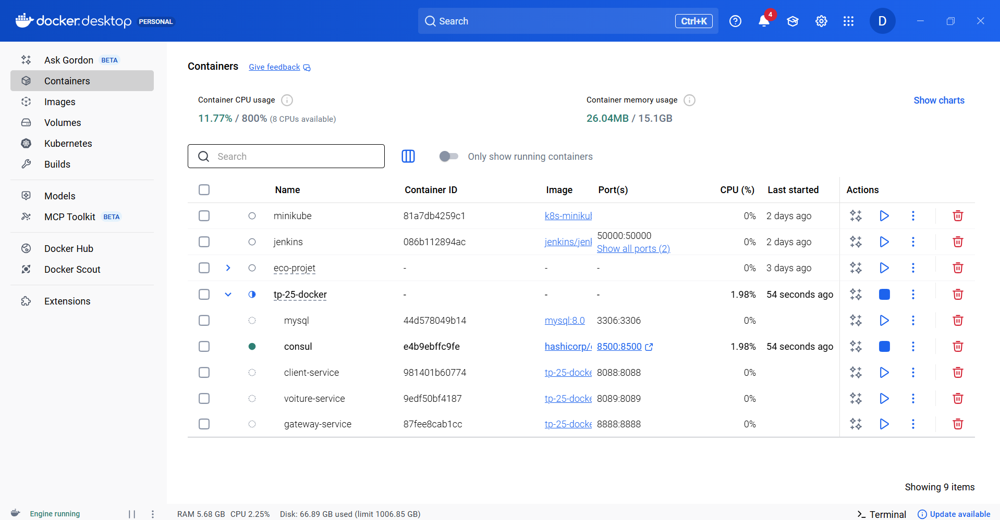

## Docker Compose – Execution

###  Pulling Docker Images

###  Containers Running Successfully

## Docker Desktop – Running Containers

The screenshot below shows the Docker Desktop interface with all containers
successfully running for the **TP-25-Docker** microservices project.

It confirms that the following components are up and running:
- MySQL database (port 3306)
- Consul service discovery (port 8500)
- Client Service (port 8088)
- Voiture Service (port 8089)
- Gateway Service (port 8888)

All containers are connected through a dedicated Docker network and are
operating correctly.

